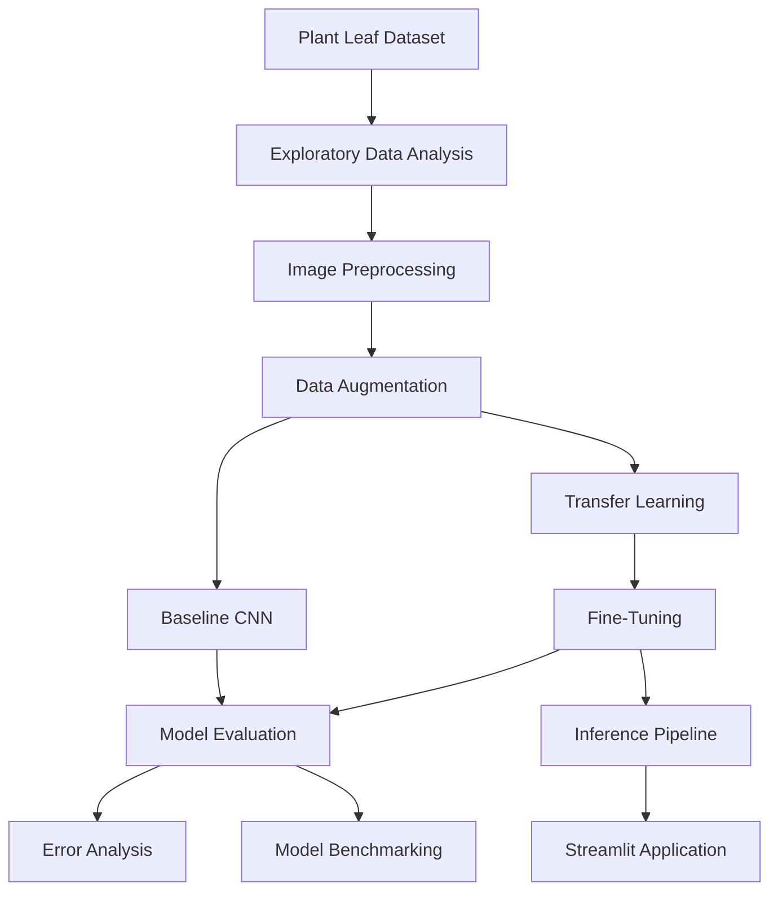
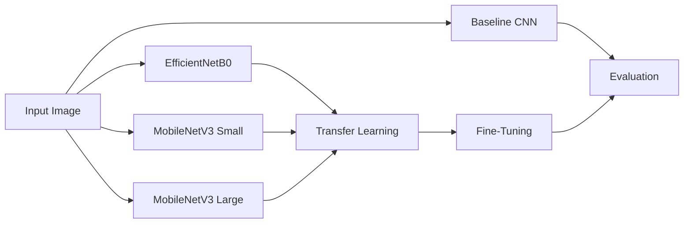
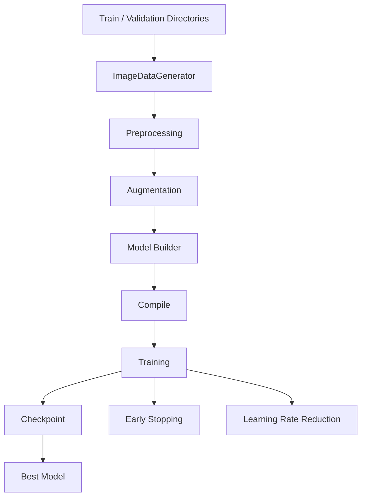
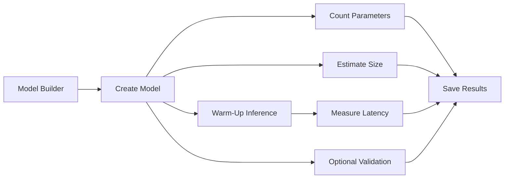
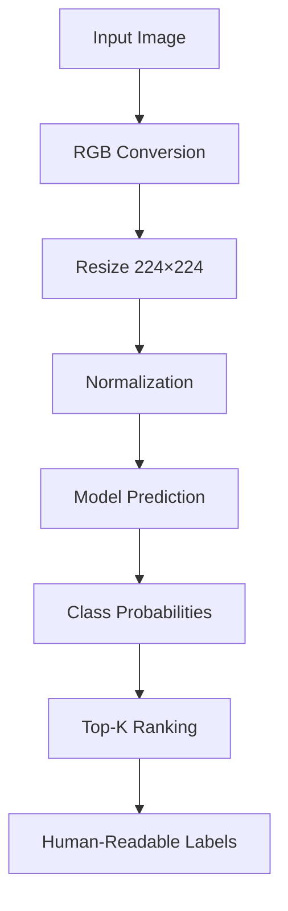

# 🌿 Plant Disease Classification

<p align="center">

<strong>Deep Learning • Computer Vision • Transfer Learning • Model Evaluation • Deployment</strong>

<br><br>

A complete end-to-end deep learning pipeline for classifying plant leaf diseases across <strong>38 classes</strong>, with model experimentation, transfer learning, fine-tuning, comprehensive evaluation, error analysis, benchmarking, and an interactive Streamlit inference application.

</p>

<p align="center">


</p>

---

## 📌 Table of Contents

<details>
<summary><strong>Click to expand</strong></summary>

- [Overview](#-overview)
- [Problem Statement](#-problem-statement)
- [Project Objectives](#-project-objectives)
- [Solution Overview](#-solution-overview)
- [Dataset](#-dataset)
- [Data Preparation](#-data-preparation)
- [Model Development](#-model-development)
  - [Baseline CNN](#1-baseline-cnn)
  - [Transfer Learning](#2-transfer-learning)
  - [Fine-Tuning](#3-fine-tuning)
- [Training Pipeline](#-training-pipeline)
- [Evaluation Strategy](#-evaluation-strategy)
- [Results](#-results)
- [Error Analysis](#-error-analysis)
- [Model Benchmarking](#-model-benchmarking)
- [Inference Pipeline](#-inference-pipeline)
- [Streamlit Application](#-streamlit-application)
- [Repository Structure](#-repository-structure)
- [Notebooks](#-notebooks)
- [Reports & Artifacts](#-reports--artifacts)
- [Testing](#-testing)
- [Continuous Integration](#-continuous-integration)
- [Technology Stack](#-technology-stack)
- [Installation](#-installation)
- [Running the Application](#-running-the-application)
- [Training](#-training)
- [Evaluation](#-evaluation)
- [Benchmarking](#-benchmarking)
- [Design Decisions](#-design-decisions)
- [Key Learnings](#-key-learnings)
- [Limitations](#-limitations)
- [Future Improvements](#-future-improvements)
- [Project Status](#-project-status)
- [Author](#-author)

</details>

---

# 🌱 Overview

Plant diseases can significantly affect crop productivity and plant health. Early identification can help farmers and agricultural professionals take appropriate action before disease progression becomes severe.

This project investigates a **deep-learning-based computer vision approach** for identifying plant diseases from leaf images.

The system treats the problem as a **38-class image classification task**.

Instead of building only a single CNN and reporting accuracy, the project follows an end-to-end machine learning workflow:



### Current evaluated performance

| Metric | Result |
|---|---:|
| Classification classes | **38** |
| Validation samples | **17,572** |
| Accuracy | **89.78%** |
| Macro Precision | **91.05%** |
| Macro Recall | **89.80%** |
| Macro F1 | **89.65%** |
| Weighted F1 | **89.64%** |

> **Important:** These results represent performance on the project's validation dataset and should not be interpreted as guaranteed real-world agricultural diagnostic accuracy.

---

# 🎯 Problem Statement

Manual identification of plant diseases from visual symptoms can be:

- time-consuming
- dependent on domain expertise
- difficult to scale
- affected by human observation errors

The goal of this project is to automate the **image classification stage** of disease identification.

Given a plant leaf image, the system attempts to determine the most likely supported plant/disease class.

### Input

```text
Plant Leaf Image
```

### Output

```text
Predicted Class
+
Confidence Score
+
Top-K Predictions
```

---

# 🎯 Project Objectives

The project was designed around the following objectives:

1. Explore and understand the plant-disease image dataset.
2. Establish a custom CNN baseline.
3. Investigate pretrained computer-vision architectures.
4. Apply transfer learning.
5. Apply controlled fine-tuning.
6. Evaluate performance using multiple metrics.
7. Analyze class-level weaknesses.
8. Identify common misclassification patterns.
9. Compare models using computational characteristics.
10. Build a reusable inference pipeline.
11. Expose the trained model through a Streamlit application.
12. Maintain reusable code, tests, and CI support.

---

# 🧠 Solution Overview

The project separates the machine-learning lifecycle into distinct stages:

| Stage | Purpose |
|---|---|
| Data Exploration | Understand dataset structure and class distribution |
| Preprocessing | Convert images into model-compatible inputs |
| Augmentation | Improve robustness during training |
| Baseline CNN | Establish a reference model |
| Transfer Learning | Reuse pretrained visual representations |
| Fine-Tuning | Adapt pretrained features to the target dataset |
| Evaluation | Quantify overall and class-level performance |
| Error Analysis | Understand model failures |
| Benchmarking | Compare efficiency and performance |
| Inference | Convert trained model into reusable prediction logic |
| Deployment | Provide an interactive Streamlit interface |

---

# 📊 Dataset

The project uses the **New Plant Diseases Dataset**.

### Dataset source

[Kaggle — New Plant Diseases Dataset](https://www.kaggle.com/datasets/vipoooool/new-plant-diseases-dataset)

### Dataset configuration

| Property | Value |
|---|---|
| Task | Multi-class image classification |
| Classes | **38** |
| Validation samples evaluated | **17,572** |
| Input type | RGB images |
| Input size | **224 × 224 × 3** |
| Label format | Integer class labels |
| Training shuffle | Enabled |
| Validation shuffle | Disabled |

The dataset itself is not committed to the repository because of its size.

---

## 🌿 Supported Classes

The project supports 38 plant health/disease classes covering crops including:

- Apple
- Blueberry
- Cherry
- Corn
- Grape
- Orange
- Peach
- Pepper
- Potato
- Raspberry
- Soybean
- Squash
- Strawberry
- Tomato

The authoritative class mapping is maintained centrally in:

```text
src/constants.py
```

This helps ensure that training, evaluation, and inference use a consistent class ordering.

---

# 🧹 Data Preparation

The training pipeline performs image preprocessing before model training.

### Image resizing

All images are resized to:

```text
224 × 224 × 3
```

### Normalization

Training and validation images are scaled to the `[0, 1]` range.

### Training augmentation

The training generator applies:

- Rotation
- Width shifting
- Height shifting
- Shearing
- Zooming
- Horizontal flipping

Validation data is not augmented because validation should represent the evaluation distribution rather than artificially modified samples.

---

# 🧠 Model Development

The repository supports multiple modelling approaches rather than relying on a single architecture.



---

## 1. Baseline CNN

A custom CNN is implemented to establish a task-specific baseline.

### Architecture

```text
Input: 224 × 224 × 3
        │
        ▼
Conv2D — 32 filters
        │
        ▼
MaxPooling
        │
        ▼
Conv2D — 64 filters
        │
        ▼
MaxPooling
        │
        ▼
Conv2D — 128 filters
        │
        ▼
MaxPooling
        │
        ▼
Conv2D — 256 filters
        │
        ▼
Global Average Pooling
        │
        ▼
Dropout
        │
        ▼
Dense — 38 classes
        │
        ▼
Softmax
```

### Why a baseline?

The baseline provides a reference point against which pretrained architectures can be evaluated.

Without a baseline, it becomes difficult to determine whether transfer learning provides meaningful improvement.

---

## 2. Transfer Learning

The training implementation supports pretrained architectures:

| Architecture | Role |
|---|---|
| EfficientNetB0 | Transfer-learning candidate |
| MobileNetV3Small | Lightweight transfer-learning candidate |
| MobileNetV3Large | Larger MobileNet variant |

The pretrained ImageNet backbone is used as a feature extractor while a new classification head is trained for the 38 target classes.

### General architecture

```text
Input Image
     │
     ▼
Pretrained CNN Backbone
     │
     ▼
Global Average Pooling
     │
     ▼
Dropout
     │
     ▼
Dense Classifier
     │
     ▼
38-Class Softmax
```

---

## 3. Fine-Tuning

After the initial transfer-learning stage, selected layers of the pretrained backbone can be unfrozen.

The implementation provides controlled fine-tuning:

- the complete backbone is initially frozen
- a configurable number of final backbone layers can be unfrozen
- Batch Normalization layers remain frozen
- the outer classification head remains intact
- classifier output is validated after modification

This is implemented in:

```text
src/training/train.py
```

---

# ⚙️ Training Pipeline

The reusable training module contains the major components required for model development.



### Training components

The pipeline supports:

- Dataset generators
- Model builders
- Model compilation
- Adam optimizer
- Sparse categorical cross-entropy
- Model checkpointing
- Early stopping
- Learning-rate reduction
- Transfer learning
- Fine-tuning
- Model output validation

---

# 📈 Evaluation Strategy

The project intentionally evaluates models using more than accuracy.

## Overall metrics

- Accuracy
- Macro Precision
- Macro Recall
- Macro F1
- Weighted F1

## Additional diagnostics

- Classification report
- Confusion matrix
- Per-class accuracy
- ROC-AUC
- Top-3 accuracy
- Misclassified examples
- Confidence distribution

The evaluation implementation is located in:

```text
src/training/evaluate.py
```

---

# 🏆 Results

The current committed evaluation report contains results from:

```text
17,572 validation samples
38 classes
```

### Overall metrics

| Metric | Score |
|---|---:|
| Accuracy | **89.78%** |
| Macro Precision | **91.05%** |
| Macro Recall | **89.80%** |
| Macro F1 | **89.65%** |
| Weighted F1 | **89.64%** |

### Why macro F1 matters

With 38 classes, accuracy alone can hide poor performance on individual categories.

Macro F1 gives each class equal importance when calculating the overall score.

This makes it particularly useful for examining whether performance is balanced across disease categories.

---

# 🔍 Error Analysis

A dedicated error-analysis workflow is included in the project.

The goal is not simply to answer:

> "How accurate is the model?"

but also:

> "Where is the model failing and why?"

---

## Lowest-performing classes

The committed evaluation report identifies several challenging classes:

| Class | Precision | Recall | F1 |
|---|---:|---:|---:|
| Tomato Early Blight | 95.24% | 37.50% | **53.81%** |
| Tomato Late Blight | 50.18% | 92.44% | **65.05%** |
| Tomato Target Spot | 80.54% | 58.86% | **68.02%** |
| Tomato Septoria Leaf Spot | 83.58% | 65.37% | **73.36%** |
| Tomato Leaf Mold | 94.30% | 63.40% | **75.83%** |

### Interpretation

**Tomato Early Blight**

The model has high precision but low recall.

This means that when it predicts Early Blight it is usually correct, but it fails to identify many actual Early Blight examples.

**Tomato Late Blight**

The model has high recall but comparatively lower precision.

It detects most actual Late Blight samples but also incorrectly assigns some other classes to Late Blight.

These examples demonstrate why class-level metrics are more informative than a single aggregate accuracy number.

---

## Error-analysis artifacts

Detailed misclassification information is stored under:

```text
reports/error_analysis/
```

including:

```text
misclassified_images.csv
```

---

# ⚖️ Model Benchmarking

The repository includes a dedicated benchmarking component.

The benchmark system can measure:

| Benchmark | Purpose |
|---|---|
| Parameter count | Model complexity |
| Estimated model size | Storage footprint |
| Inference latency | Prediction speed |
| Accuracy | Predictive performance |
| Macro F1 | Class-balanced performance |
| Weighted F1 | Overall weighted performance |
| Top-3 accuracy | Ranking quality |

### Benchmark workflow



Benchmark implementation:

```text
src/training/benchmark.py
```

Benchmark execution:

```text
scripts/run_benchmarks.py
```

---

# 🚀 Inference Pipeline

The trained model is separated from the user interface through a dedicated predictor.



The predictor performs:

- model loading
- image preprocessing
- prediction
- confidence calculation
- Top-K ranking
- class-label mapping
- output validation

The inference implementation is located in:

```text
app/predictor.py
```

---

# 🖥️ Streamlit Application

The project includes an interactive Streamlit application.

### User workflow

```text
Upload Leaf Image
        ↓
Image Preview
        ↓
Model Inference
        ↓
Predicted Plant / Disease
        ↓
Confidence Level
        ↓
Top-5 Predictions
```

The interface provides:

- image upload
- image preview
- predicted class
- plant name
- disease/healthy status
- confidence level
- Top-5 predictions
- model information
- prediction disclaimer

Run the application with:

```bash
streamlit run app/app.py
```

---

## 🧪 Confidence Interpretation

The application categorizes predictions into:

| Confidence | Interpretation |
|---|---|
| ≥ 90% | High confidence |
| 70–90% | Moderate confidence |
| < 70% | Low confidence |

> Confidence is the model's probability output and should not be interpreted as a guarantee of diagnostic correctness.

---

# 📁 Repository Structure

```text
plant-disease-classification/
│
├── .github/
│   └── workflows/
│       └── ci.yml
│
├── app/
│   ├── __init__.py
│   ├── app.py
│   └── predictor.py
│
├── models/
│   └── README.md
│
├── notebooks/
│   ├── 01_data_exploration.ipynb
│   ├── 02_model_training.ipynb
│   ├── 03_model_evaluation.ipynb
│   ├── benchmark_analysis.ipynb
│   └── benchmark_analysis.py
│
├── reports/
│   ├── full_evaluation_report.json
│   └── error_analysis/
│       └── misclassified_images.csv
│
├── scripts/
│   ├── train_model.py
│   ├── evaluate_model.py
│   ├── full_evaluation.py
│   ├── analyze_errors.py
│   └── run_benchmarks.py
│
├── src/
│   ├── __init__.py
│   ├── constants.py
│   ├── data/
│   └── training/
│       ├── __init__.py
│       ├── train.py
│       ├── evaluate.py
│       └── benchmark.py
│
├── tests/
│   ├── conftest.py
│   ├── test_prediction.py
│   └── test_benchmark.py
│
├── .gitignore
├── requirements.txt
└── README.md
```

---

# 📓 Notebooks

The repository contains notebooks for the experimental and analytical workflow.

| Notebook | Purpose |
|---|---|
| `01_data_exploration.ipynb` | Dataset exploration and visual analysis |
| `02_model_training.ipynb` | Model development and training experiments |
| `03_model_evaluation.ipynb` | Evaluation and diagnostic analysis |
| `benchmark_analysis.ipynb` | Benchmark-result exploration |

### Why notebooks + Python modules?

The project intentionally separates:

```text
Notebook
    ↓
Exploration / Visualization / Experimentation

Python Modules
    ↓
Reusable / Repeatable Implementation
```

This allows the project to retain an exploratory Data Science workflow while keeping core ML logic reusable.

---

# 📊 Reports & Artifacts

Generated project artifacts are stored under:

```text
reports/
```

### Full evaluation report

```text
reports/full_evaluation_report.json
```

Contains:

- overall metrics
- class-level metrics
- confusion matrix
- ROC-AUC information
- Top-3 accuracy
- misclassified examples
- confidence information

### Error analysis

```text
reports/error_analysis/misclassified_images.csv
```

Contains information about incorrectly classified samples.

---

# 🧪 Testing

The repository includes automated tests under:

```text
tests/
```

Current test coverage includes prediction and benchmarking-related functionality.

Run tests using:

```bash
pytest
```

The purpose of the tests is to verify critical components independently from the training notebooks.

---

# 🔄 Continuous Integration

GitHub Actions is configured under:

```text
.github/workflows/ci.yml
```

The CI workflow helps validate repository health automatically.

This supports the project's engineering side in addition to its machine-learning components.

---

# 🛠️ Technology Stack

## Programming

- Python

## Deep Learning

- TensorFlow
- Keras

## Computer Vision

- OpenCV
- Pillow

## Data Science

- NumPy
- Pandas

## Evaluation

- Scikit-learn
- Matplotlib

## Deployment

- Streamlit

## Testing

- Pytest

## Version Control / CI

- Git
- GitHub
- GitHub Actions

---

# ⚙️ Installation

## 1. Clone the repository

```bash
git clone https://github.com/siddhikalolage/plant-disease-classification.git
cd plant-disease-classification
```

## 2. Create a virtual environment

```bash
python -m venv .venv
```

### Windows

```bash
.venv\Scripts\activate
```

### Linux / macOS

```bash
source .venv/bin/activate
```

## 3. Install dependencies

```bash
pip install -r requirements.txt
```

---

# ▶️ Running the Application

Ensure the trained model is available at the location expected by the application.

Then:

```bash
streamlit run app/app.py
```

---

# 🏋️ Training

The main reusable training functionality is located in:

```text
src/training/train.py
```

Executable training workflows are available under:

```text
scripts/
```

The training pipeline supports:

- dataset loading
- preprocessing
- augmentation
- baseline CNN
- EfficientNetB0
- MobileNetV3Small
- MobileNetV3Large
- transfer learning
- fine-tuning
- checkpointing
- early stopping
- learning-rate reduction

---

# 📈 Evaluation

The comprehensive evaluation workflow is available through:

```text
scripts/full_evaluation.py
```

The evaluation system supports:

```text
Accuracy
Precision
Recall
Macro F1
Weighted F1
ROC-AUC
Top-3 Accuracy
Confusion Matrix
Per-Class Accuracy
Classification Report
Misclassified Examples
Confidence Distribution
```

---

# ⚖️ Benchmarking

Benchmarking can be executed using:

```bash
python scripts/run_benchmarks.py
```

The benchmark system can compare model:

- size
- parameters
- inference latency
- accuracy
- macro F1
- weighted F1
- Top-3 accuracy

Results can be saved to CSV for subsequent analysis.

---

# 🧩 Design Decisions

## Why use a baseline CNN?

To establish a reference point before using pretrained networks.

## Why use transfer learning?

Pretrained networks provide useful visual representations learned from large image datasets.

## Why fine-tune?

The target domain differs from the original pretraining domain. Fine-tuning allows selected pretrained features to adapt to plant-disease characteristics.

## Why freeze Batch Normalization during fine-tuning?

Batch Normalization statistics can become unstable during small fine-tuning runs. Keeping these layers frozen provides more controlled adaptation.

## Why use macro F1?

A multi-class dataset can contain classes with substantially different performance. Macro F1 gives each class equal importance.

## Why perform error analysis?

A model can achieve high aggregate accuracy while failing badly on specific disease classes. Error analysis exposes these weaknesses.

## Why benchmark models?

A model with slightly better accuracy may not always be the best deployment choice if it has substantially higher computational cost or latency.

---

# 💡 Key Learnings

This project provided practical experience with:

### Machine Learning

- Multi-class classification
- Training/validation workflows
- Model selection
- Performance evaluation

### Deep Learning

- CNN architecture design
- Transfer learning
- Fine-tuning
- Image augmentation
- Model checkpointing

### Computer Vision

- Image preprocessing
- Image normalization
- Visual feature extraction
- Image classification

### Model Evaluation

- Precision
- Recall
- F1-score
- Macro vs weighted metrics
- ROC-AUC
- Top-K accuracy
- Confusion matrices
- Error analysis

### ML Engineering

- Reusable training modules
- Dedicated inference layer
- Model validation
- Benchmarking
- Automated testing
- CI workflows

### Deployment

- Streamlit application development
- Model loading
- Interactive image inference
- Confidence presentation

---

# ⚠️ Limitations

This project should be interpreted as a machine-learning research/portfolio implementation rather than a production agricultural diagnostic system.

### Dataset limitation

The reported evaluation is based on the project's validation dataset.

### Domain shift

Real-world field images may differ significantly because of:

- lighting
- camera quality
- backgrounds
- blur
- occlusion
- leaf orientation
- disease severity

### Visually similar diseases

Some disease classes, particularly several tomato disease categories, remain difficult to distinguish.

### Classification scope

The model classifies an image into one class.

It does not currently perform:

- disease localization
- object detection
- segmentation
- multiple-disease detection
- treatment recommendation

### External validation

Independent external-dataset validation is not currently part of the reported evaluation.

---

# 🔮 Future Improvements

Potential future improvements include:

1. External dataset validation.
2. Real-world field-image evaluation.
3. Grad-CAM-based explainability.
4. Confidence calibration.
5. Improved handling of visually similar classes.
6. Field-specific data augmentation.
7. Image-quality validation before inference.
8. Model quantization.
9. Edge/mobile deployment.
10. Disease-region segmentation.
11. Object detection for multiple leaves/diseases.
12. Larger and more diverse field datasets.

---

# 📌 Project Status

**Current status: Completed portfolio / academic ML project**

The repository currently contains:

- exploratory notebooks
- model-training pipelines
- transfer-learning architectures
- fine-tuning utilities
- evaluation utilities
- error-analysis artifacts
- benchmarking utilities
- automated tests
- CI configuration
- Streamlit inference application

---

# ⚠️ Disclaimer

This project is intended for:

- educational use
- machine-learning experimentation
- portfolio demonstration
- research exploration

Predictions should **not** be treated as professional agricultural diagnosis or as a substitute for consultation with a qualified agricultural expert.

---

# 👨‍💻 Author

## Siddhika Lolage

**BE — Information Technology**

Pune, India

GitHub:

https://github.com/siddhikalolage

---

# ⭐ Project Summary

This project demonstrates an end-to-end computer vision workflow:

```text
Data
 ↓
Exploration
 ↓
Preprocessing
 ↓
Augmentation
 ↓
Baseline CNN
 ↓
Transfer Learning
 ↓
Fine-Tuning
 ↓
Evaluation
 ↓
Error Analysis
 ↓
Benchmarking
 ↓
Inference
 ↓
Streamlit Deployment
```

The main objective was not simply to obtain a high accuracy score, but to understand the complete lifecycle of developing, evaluating, diagnosing, and deploying a multi-class deep-learning model.
